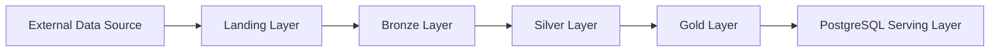

## 🚀 Overview

### Purpose of the Project
This repository implements a production-style data engineering pipeline for **crisis and event monitoring**, ingesting multiple real-world political event datasets and transforming them into analytics-ready, structured outputs. The goal is to demonstrate **modern data engineering best practices**, including layered storage, robust data quality checks, incremental processing, and reproducible, testable pipelines.

### Key Features
- **Medallion Architecture:** Landing → Bronze → Silver → Gold → PostgreSQL serving layer
- **Multi-Source Integration:** GDELT (automated download) and ACLED (manual ingestion)
- **Incremental & Full Processing:** Append, Overwrite, Snapshot ingestion modes
- **Partitioned Parquet Storage:** Hive-style directory layout for efficient queries
- **Containerized Development:** Docker Compose setup for local PostgreSQL
- **Data Quality Framework:** Critical (fail-pipeline) and monitoring (warn-only) checks
- **Reproducible & Configurable:** Environment variables and schema/config YAMLs
- **Logging & Traceability:** Run-level logs with unique run IDs
- **Testing Suite:** Unit, integration, and end-to-end tests for reliability

### Project Status

The core ETL pipeline is largely implemented and functional, but several features and improvements are still planned or in progress. The following list highlights the main outstanding items:

**Outstanding / Planned Work:**
- **Environment Handling:** Separate dev vs prod; prevent parallel runs in production
- **Data Quality Checks:** Implement temporal, completeness, and content validation checks in addition to existing schema checks 
- **Integration & End-to-End Tests:** Full pipeline coverage with real datasets
- **CI/CD Automation:** GitHub Actions for automated testing
- **Warning Notifications:** Slack/email/webhook alerts for data quality or pipeline issues
- **Log Management:** Replace intermediate run files with structured logs
- **Run Metadata:** Make the set of embedded record-level metadata columns configurable for each layer
- **Code Refactoring:** Remove redundancies and streamline layer runs and utilities 

## 📊 Data Sources

### GDELT (Global Database of Events, Location, and Tone)
**Source:** [GDELT Events](http://data.gdeltproject.org/events/index.html)  
**Access & Ingestion:** Publicly available  
**Data Freshness:** Daily updates (6AM EST)

**Description:**  
GDELT monitors global news media and extracts structured event data, capturing political, social, and economic events. Each event typically includes:

- Event date and time
- Actor countries and organizations
- Event type and codes
- Tone / sentiment metrics
- Geographic information

**Usage in Project:**  
- Automated daily download
- Aggregation to country-month metrics
- Used to compute event volumes and sentiment indicators

---

### ACLED (Armed Conflict Location & Event Data Project)
**Source:** [ACLED](https://acleddata.com/aggregated/number-political-violence-events-country-month-year)  
**Access & Ingestion:** Manual download required (login and access restrictions)  
**Data Freshness:** Periodic updates (infrequent - several times per month)

**Description:**  
ACLED provides high-quality political violence and protest event data, including detailed conflict classifications at the country-month level.

**Usage in Project:**  
- Aggregated to country-month level
- Used to compute number of political violence events

---

### Why Combine Both Sources
- **GDELT:** Broad global coverage, automated daily ingestion  
- **ACLED:** High-quality, curated political violence data  
- **Combined Benefits:** Cross-source validation, richer country-level metrics, more robust monitoring signals


## 🏗 Architecture
### Data Flow Overview 
The pipeline follows a classic medallion architecture with layered storage, supporting incremental and full-refresh processing. Data flows from raw ingestion to analytics-ready datasets.



### Medallion Layer Design
The pipeline follows a **layered medallion architecture** to manage data in a structured, modular way.  
Each layer has a clear responsibility, balancing historical traceability with a current-state view for analytics.  
Layered data architecture enforces separation of concerns, improving modularity, maintainability, and scalability while enabling independent development, parallel processing, and easier system updates.

#### Landing
- Stores raw data files as they are received from external sources.
- Serves as the base for **manual data drops** (e.g., ACLED) and automated downloads (e.g., GDELT).
- Maintains **historical raw files** for traceability and reprocessing if needed.
- Minimal transformation; files are simply copied or extracted into the landing folder.

#### Bronze
- Converts raw landing files into **parquet format** for faster downstream processing.
- Applies no transformations yet but allows for first data quality checks like required columns. 
- Maintains **historical parquet files** alongside landing for reproducibility.
- Provides a consistent, queryable base for silver-layer transformations.

#### Silver
- Contains **cleaned, standardized, and deduplicated datasets**.
- Enforces **full schema compliance** and applies critical data quality checks.
- Only the **current state** of each dataset is stored, no historical snapshots.
- Serves as the primary input for aggregation and analytics in the gold layer.

#### Gold
- Holds **analytics-ready aggregated tables** (e.g., country-month metrics, sentiment scores).
- Only the **current state** is maintained; historical detail is kept in bronze if needed.
- Serves as the **source of truth for downstream consumers**, including PostgreSQL or potential BI tools.
- Optimized for fast query and reporting.

### Processing Strategy

#### Source Aquisition Mode 

The pipeline supports multiple acquisition strategies to handle diverse data sources. 

- **Manual Data Drop:**  
  Some data sources (e.g., ACLED) have access restrictions that prevent automated downloads.  
  Users must manually place the source files into the `landing/` directory.  
  This ensures compliance with licensing while still allowing the pipeline to process the data.

- **Automated HTTP Download:**  
  Publicly available sources (e.g., GDELT) are downloaded automatically via HTTP.  
  Downloads use retry logic and timeout handling.  
  This ensures the pipeline always has the most recent data without manual intervention.


#### File Ingestion Modes

Regardless of the ingestion mode, the **Landing** and **Bronze** layers retain all **historical versions** of data, whether downloaded manually or automatically.  
In **Silver** and **Gold**, only the most **recent state** of the data is kept. The processing logic adapts depending on the chosen ingestion mode:

- **Append (Incremental Processing):**  
  Files already present in the landing layer are not re-downloaded (no updates to existing files).  
  From the Silver layer onward, only new files are processed incrementally into the existing dataset. Processed files are tracked using checkpoint files in the respective layer directories (e.g., `data/layer/bronze/gdelt/_checkpoint.yaml`).

  **Advantages:**  
  - Efficient for large datasets  
  - Maintains historical data in Landing/Bronze layers  
  - Reduces compute and storage requirements  

- **Overwrite (Full Refresh):**  
  Existing files in the landing layer are replaced with the current state of the source file, allowing for updates within files. Note that previously replaced files still remain in the Landing and Bronze layers.  
  From the Silver layer onward, all pre-existing data is re-processed and overwritten with the current data state.

  **Advantages:**  
  - Ensures complete consistency if upstream data changes  
  - Useful for correcting errors in historical data  
  - Recommended for small-to-medium datasets or low-frequency sources  

- **Snapshot (Latest-State Materialization):**  
  Some sources (e.g., ACLED) provide snapshot files. While Landing and Bronze layers retain all historical snapshots, from Silver onward only the latest snapshot version is processed.

  **Advantages:**  
  - Keeps Silver/Gold layers lightweight and analytics-ready  
  - Supports scenarios where only the current state matters (e.g., dashboards)
  - Reduces compute and storage requirements  


## 📦 Storage & Serving

The pipeline leverages a **layered storage strategy** to balance historical traceability with analytics-ready datasets, combining parquet-based lake storage with a relational serving layer.

### Parquet Lake Storage
- In the Raw, Silver and Gold Layer data is stored in **parquet format** for efficient columnar storage and fast reads.
- Parquet enables schema enforcement, compression, and compatibility with downstream analytics tools.

### Hive-Style Partitioning
- In the silver layer, while the ingestion mode is not `latest_snapshot`, data is stored in partitions  
- Data is partitioned by key dimensions (e.g., `event_date` for GDELT) following **Hive-style folder conventions**.
- Partitioning improves query performance, enables incremental processing, and organizes files for reproducibility.
- Example layout: `data/silver/gdelt/event_date=2016-01-04 00:00:00+00:00/part.parquet`

### PostgreSQL Serving Layer
- Gold-layer tables are loaded into **PostgreSQL** for relational access and analytics.
- Enables:
  - SQL-based queries for dashboards or reporting
  - Integration with BI tools
  - Lightweight storage of analytics-ready tables
- Postgres serves as the **production-grade serving layer**

### Loading Gold Data into PostgreSQL
- Gold tables are loaded into PostgreSQL after aggregation and DQ checks.
- Ensures that the serving layer is always in sync with the latest analytics-ready state.

### Dockerized Local Database
- The pipeline includes a **local PostgreSQL instance** via `docker-compose.yaml` for development and testing.
- Data is persisted in a **Docker volume**, so it survives container restarts unless explicitly removed.
- Using Docker ensures that the database environment is:
  - **Isolated:** No conflicts with local or system-wide PostgreSQL installations
  - **Reproducible:** The same version and configuration is available on any machine
  - **Portable:** Easy to start, stop, or reset without affecting the host system
- Typical use cases:
  - Local development and experimentation
  - End-to-end testing of the ETL pipeline
  - Running queries against the gold tables without needing a production database


## 🛠 Setup & Installation
### Project Structure

```bash
src/
├── layer/                         # Layer-specific ETL logic
│   ├── bronze/                    # Bronze layer: landing files/raw parquet data, minimal transformations
│   │   ├── metadata.py            # Layer metadata
│   │   ├── run.py                 # Bronze layer ETL execution script
│   │   └── transforms.py          # Generic transformation functions
│   │
│   ├── silver/                    # Silver layer: cleaned, schema-enforced, current-state data
│   │   ├── transforms/            # Silver layer transformation modules
│   │   │   ├── custom/            # Custom transformations for specific tables
│   │   │   ├── common.py          # Shared transformation functions
│   │   │   └── custom_registry.py # Registry for registering custom transformations
│   │   ├── run.py                 # Silver layer ETL execution script
│   │   └── metadata.py            # Layer metadata
│   │
│   └── gold/                      # Gold layer: aggregated, analytics-ready datasets
│       ├── transforms/            # Gold layer transformation modules
│       │   ├── custom/            # Custom aggregation functions
│       │   ├── common.py          # Shared transformation functions
│       │   └── custom_registry.py # Registry for registering custom aggregations
│       └── run.py                 # Gold layer ETL execution script
│
├── utils/                         # Reusable utility modules
│   ├── dataframe.py               # DataFrame manipulation helpers
│   ├── data_quality_checks.py     # Data quality checks (schema, content, temporal)
│   ├── io.py                      # Input/output helpers for reading/writing files
│   ├── run.py                     # Run metadata and checkpoint management
│   ├── schema.py                  # Schema enforcement & validation functions
│   ├── storage.py                 # File system / Parquet storage utilities
│   └── system.py                  # System-level utilities (e.g., environment handling, logging, time, ...)
│
├── pipeline_orchestrator.py       # Single entry point for orchestrating full ETL pipeline
├── load_postgres.py               # Loads gold-layer tables into PostgreSQL
│
scripts/
└── run_pipeline.sh                # Shell script wrapper to run orchestrator or individual layers
│
tests/
├── end2end/                       # End-to-end pipeline tests
├── unit/                          # Unit tests for functions and utils
└── integration/                   # Integration tests across layers
│
data/                              # Layered storage for data files
├── landing/                       # Raw downloaded source files (manual or automated)
├── bronze/                        # Raw/parquet files with minimal transformations
├── silver/                        # Cleaned, schema-enforced, current-state data
└── gold/                          # Aggregated, analytics-ready datasets
│
logs/                              # Structured log files for pipeline / individual layer runs
│
config/
├── pipeline.yaml                  # Pipeline parameters, e.g. date range to consider and the timezone 
├── schemas.yaml                   # Required schema per layer and table
└── sources.yaml                   # Source parameters required to download files from source
.env                               # Environment variables
.env.example                       # Example environment variables file
.gitignore                         # Files/directories to ignore in Git
docker-compose.yaml                # Docker setup for local PostgreSQL
README.md                          # Project documentation
requirements.txt                   # Python dependencies

```

### Prerequisites
- Python >= 3.10  
- `pip` package manager  
- Docker & Docker Compose (for local PostgreSQL)  
- Git  

---

### Clone Repository
```bash
git clone https://github.com/VivienDrescher/crisis_and_event_monitoring-etl.git
cd crisis_and_event_monitoring-etl
```

### Python Environment Setup 
Create a virtual environment and activate it:

```bash
python -m venv .venv
source .venv/bin/activate     # Mac/Linux
.venv\Scripts\activate        # Windows
```

### Install Dependencies 
```bash
pip install -r requirements.txt
```

### Environment Configuration (.env)
Create `.env` file in the project root based on the provided file `.env.example`

### Pipeline, Schema & Source Configurations (config/...)
Review the following files to ensure the pipeline, schemas and sources and configured as required: 
- `configs/pipeline.yaml`
- `configs/schemas.yaml`
- `configs/sources.yaml`

### Docker & PostgreSQL Setup 
> Note: Docker must be installed and running to start the local PostgreSQL container.

**Start the database**:
```bash
docker compose up -d  
```

- When needed, **stop the database**: 
```bash 
docker compose down 
```
  
### Running the Pipeline 
You can run the **full pipeline orchestrator** or **individual layer scripts**: 
- **Full pipeline**
  ```bash
  python -m src.pipeline_orchestrator
  ```

- **Individual Layer (example: Bronze)**
  ```bash
  python -m src.layers.bronze.run 
  ```

### Cron Scheduling 
Automate daily or periodic local runs using cron 

**Open crontab**:
```bash
crontab -e 
```

**Example**: run orchestrator daily at 8AM  
```bash                     
0 8 * * * <absolute_path_to_local_repo>/scripts/run_pipeline.sh
```

> Note: Replace `<absolute_path_to_local_repo>` with the full path of your local repository (`pwd` on Linux/macOS or `%CD%` in Windows).


## 🏆 Data Quality Checks
The pipeline implements data quality (DQ) checks to ensure structural integrity, correctness, and completeness of the ingested data. Checks are categorized by type, and each may either **fail the pipeline** (critical) or **log warnings only** (monitoring).

### 1. Schema Checks
Ensure that the data conforms to the expected schema.
- Required columns exist
- Non-nullable columns
- Primary key existence and uniqueness
- Column types match schema
- Partition key existence (for paritioned file writes only)
- Record timestamp key existence (for paritioned file writes only)
> **Fail-Fast:** Missing or invalid schema elements stop the pipeline.

### 2. Content Checks
Validate the contents of columns for correctness.
- Value ranges
- Category validity
- String format (regex)
- No negative values
> **Monitoring:** Warnings are logged but do not stop execution.

### 3. Temporal Checks
Validate time-related aspects of the data.
- Timestamp coverage over expected date range
- No future timestamps
- Data recency (latest timestamp within allowed interval)
> **Monitoring:** Warnings are logged if temporal constraints are violated.

### 4. Completeness Checks
Ensure that expected records are present.
- All expected entities, dates, or partitions are represented
> **Fail-Fast or Monitoring:** Depending on the layer and business rules.

### Where DQ Is Applied in the Pipeline
Data quality checks are executed immediately after the transformations in each layer, ensuring that only validated data progresses downstream:  

- **Bronze Layer:** Performs basic schema validations, such as required column existence.  
- **Silver Layer:** Applies all schema checks; other content, temporal, and completeness checks are planned for future implementation.  
- **Gold Layer:** Currently applies schema checks on aggregated datasets; additional checks (content, temporal, completeness) will be added as the pipeline matures.  

All logs and warnings are recorded in structured log files for each run, enabling traceability and review of any issues detected.

## 🧪 Testing

The project includes a comprehensive testing strategy to ensure correctness, reliability, and maintainability of the ETL pipeline.

### Unit Tests
- Focus on individual utility functions, schema enforcement, and data quality checks.
- Fast to execute and run in isolation.
- Example: verifying `cast_to_schema`, `check_column_types`, or data transformations.

### Integration Tests
- Test interactions between multiple modules or layers.
- Ensure that data flows correctly from one layer to another and transformations are applied as expected.
- Example: Bronze → Silver transformation with sample input data.

### End-to-End Tests
- Execute the full pipeline from ingestion to Gold and PostgreSQL serving.
- Validate overall workflow, checkpointing logic, and logging.
- Uses realistic sample datasets to simulate production scenarios.

### How to Run Tests
**Activate your Python environment:**  
```bash
source .venv/bin/activate    # Mac/Linux
.venv\Scripts\activate       # Windows
```

**Run all tests:** 
```bash
python -m pytest
```

**Run a specific test file or directory:** 
```bash
python -m pytest -v tests/unit/test_data_quality_checks.py
```


## 📈 Observability

Observability ensures that every pipeline run is traceable, auditable, and reproducible. This is achieved via structured logging, run metadata, and per-run YAML files that capture detailed processing information.

### Logging Strategy
- Each pipeline run generates a structured **log file** in `logs/local_runs/<layer>/<table>/<run_id>.log`.
- Logs capture:
  - Processing timestamps
  - Layer-specific processing messages
  - Data quality warnings
  - Errors and stack traces
- Logging levels:
  - `INFO`: Standard processing messages
  - `WARNING`: Non-critical data issues (e.g., value range violations)
  - `ERROR`: Critical failures that stop the pipeline
- Logs enable detailed analysis and debugging without inspecting the raw data.

### Run Metadata Files
- Each run generates a **YAML run file** stored in: `data/<layer>/<table>/runs/run<timestamp>.yaml`
- Captures metadata for the entire run:
  - `run_id`, `git_commit`, `layer`, `table`
  - `log_file` path
  - Number/names of processed input/output files
  - Pipeline, schema, and source configuration snapshots
  - Start/end timestamps and duration
- Purpose: reproducing exact runs and tracking layer-level processing.

### Embedded Record-Level Metadata
- Additional columns are added to Parquet datasets to track **lineage at the record level**:
- **Bronze layer:**
  ```python
  df["_bronze_ingested_at"] = now_iso(timezone)
  df["_source_name"] = source_name
  df["_source_file"] = source_file
  df["_bronze_run_id"] = bronze_run_id
  ```
- **Silver layer:**
  ```python
  df["_silver_ingested_at"] = now_iso(timezone)
  df["_silver_run_id"] = silver_run_id
  df["_bronze_ingested_at"] = bronze_ingested_at
  df["_bronze_run_id"] = bronze_run_id
  ```
- Purpose: allows tracing every record back to its source file and the run that produced it.

### Reproducibility
- Combined logs, run YAML files, and embedded metadata ensure full reproducibility:
- Incremental processing is deterministic using checkpoints and run IDs.
- Config snapshots guarantee the same schema, source, and pipeline settings.
- Embedded metadata allows record-level lineage tracking.

### Git Version Tracking
- Each run records the Git commit hash to identify the exact code version used.

## 📜 License 
This project is licensed under the **MIT License** – see the [LICENSE](LICENSE) file for details.  
You are free to use, modify, and distribute this code, provided the license terms are respected.

## 👤 Author 
**Vivien** – Data Engineering Portfolio Project  
- GitHub: [VivienDrescher](https://github.com/VivienDrescher)  

